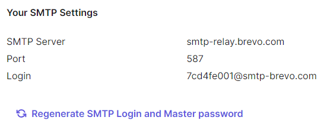
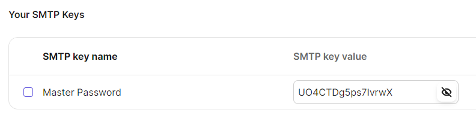
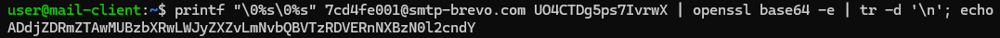
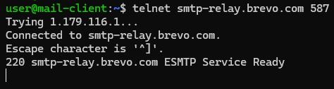
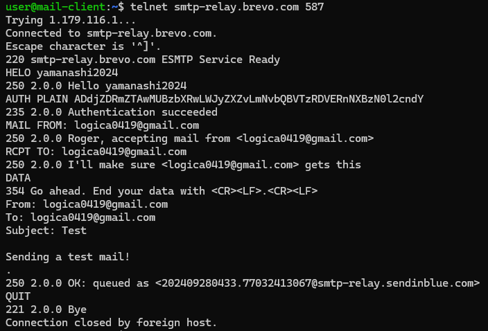
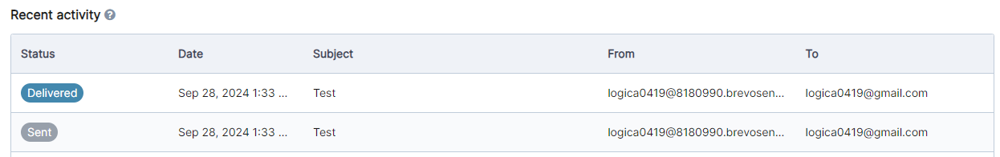
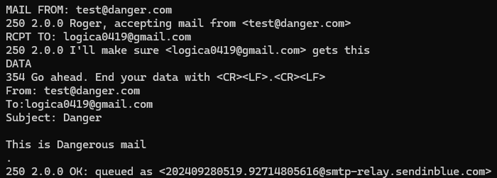
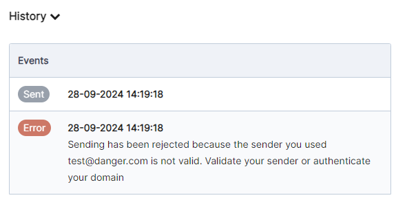
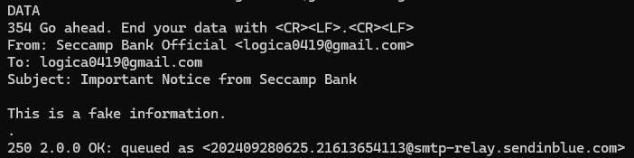
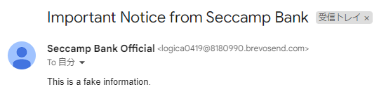

# ハンズオン 説明書

「telnetを使い、SMTPを手書きしてみよう！」ハンズオンの資料です。  
各自、自分のペースで進めてみて下さい。

## 事前準備

- Brevoを開く
  - Brevoにログインし、以下の2ページを開いておいてください。
  - <https://app.brevo.com/settings/keys/smtp>
  - <https://app-smtp.brevo.com/real-time>
- telnetの使えるコマンドラインツールを開く

## 正常なメールを送ってみよう

### 認証用の文字列を作成する

<https://app.brevo.com/settings/keys/smtp> から認証情報を入手します。

**「Login」の項目**が、今回使用する**ユーザー名**です。  


また、ページ下部の方から**パスワード**が取得できます。  
**「SMTP key value」の項目**の**目のアイコンをクリック**し、パスワードを表示しておきましょう。  


これらの認証情報を使って、認証用の文字列を作成します。  
マシン上で、以下のコマンドを実行してください。  
(`{ユーザー名}`と`{パスワード}`は、上記で取得したものに置き換えてください)

```bash
printf "\0%s\0%s" {ユーザー名} {パスワード} | openssl base64 -e | tr -d '\n'; echo
```

例として、上記の認証情報を使うと以下のような文字列が出力されます。  

ここで出力されたランダムな文字列は、**今後何回か使います**。  
文字列を選択した後`Ctrl + c` (`Command + c`) でコピーし、メモ帳などに`Ctrl + v` (`Command + v`) で貼り付けて**保存して**おきましょう。

---

<details>
<summary>コマンドに関する補足説明</summary>

今回は、SMTP AUTHの中で最も単純な認証方法、SMTP AUTH PLAINを使います。  
AUTH PLAINは、`ユーザ名\0ユーザ名\0パスワード`または`\0ユーザ名\0パスワード`をBase64エンコードしたものを指定することで認証できます。

Base64エンコードは、画像や音声など、どんなデータでも可逆的にテキストデータに変換することができるエンコード方式です。  
あらゆるデータを文字列として扱うことができるため、幅広い場面で使われます。  
<https://ja.wikipedia.org/wiki/Base64>

</details>

---

### telnetでBrevoのSMTPサーバーに接続する

いよいよSMTPサーバーに接続してみましょう。  
以下のコマンドで、BrevoのSMTPサーバーに接続します。  

```bash
telnet smtp-relay.brevo.com 587
```

以下のような表示が出れば成功です！  


---

<details>
<summary>コマンドに関する補足説明</summary>

telnetは、本来SSH同様、他のコンピューターを遠隔操作するために生まれたコマンドです。  
現在はSSHが主流になり、上記の目的ではほぼ使われなくなりました。

telnetは今回のように、任意のアドレス・ポートに対してTCP接続を行い、手書きでデータをやり取りするという目的でも使うことができます。  
今回は、SMTPプロトコルを手書きするという目的のため、telnetを使ってTCP接続を行い、その上でSMTPプロトコルのテキストを送り合う方式を採用しました。

今回のコマンドでは、`smtp-relay.brevo.com`というアドレスの587番ポート (認証必須のSMTP通信用ポート) に対して接続を行っています。

</details>

---

### SMTPを手書きしてみる

講義で触れたとおり、SMTPは**対話型のプロトコル**です。  
コマンドを一つ一つ入力して自分の情報 / メールの情報を渡し、それぞれに対してサーバーが応答を返してくれます。

以下のような流れで送信を行います。  
全ての場所に置いて、**日本語を入力してしまうと文字化けします**！  
ご注意ください。

- 自己紹介をする
  - まずは自己紹介をします。以下の文字列を入力して下さい。

  ```bash
  HELO yamanashi2024
  ```

  - `250 2.0.0 Hello yamanashi2024`と出れば成功です！
- 認証する
  - 次に認証を行います。以下の文字列を入力してください。  
    - `{認証用文字列}`は、「認証用の文字列を作成する」にて事前に作成したものに置き換えてください。

  ```bash
  AUTH PLAIN {認証用文字列}
  ```

  - `235 2.0.0 Authentication succeeded`と出れば成功です！
- 送り主を伝える
  - 送り主のアドレスを伝えます。以下の文字列を入力してください。
    - `{Brevoに登録したメールアドレス}`は、各自登録したメールアドレスに置き換えてください。

  ```bash
  MAIL FROM: {Brevoに登録したメールアドレス}
  ```

  - `250 2.0.0 Roger, accepting mail from {登録したメールアドレス}`と出れば成功です！
- 宛先を伝える
  - 宛先のアドレスを伝えます。以下の文字列を入力してください。
    - `{宛先メールアドレス}`は、メールを送りたいアドレスに置き換えてください。
    - **自分で見れるメールアドレス**に送信しましょう！

  ```bash
  RCPT TO: {宛先メールアドレス}
  ```

  - `250 2.0.0 I'll make sure {宛先メールアドレス} gets this`と出れば成功です！
- メールの内容を入力する
  - メールの内容を入力します。まずは以下の文字列を入力してください。

  ```bash
  DATA
  ```

  - `354 Go ahead. End your data with <CR><LF>.<CR><LF>`と出て、**情報を入力する準備が整った**ことが通知されます。
  - その後、以下のように文字列を入力します。  
    - `{}`で囲まれた文字列は、適宜置き換えてください。

  ```bash
  From: {Brevoに登録したメールアドレス}
  To: {宛先メールアドレス}
  Subject: {メールの件名 (自由)}

  {メールの本文 (自由)}
  .
  ```

  - **最後の`.`(ピリオド) を打った後にEnterおす**と、メールが送信されます。
  - `250 2.0.0 OK: queued as {メールID}`と出れば成功です！
    - しばらく待っても文字列が出なければ、恐らく失敗しています
- SMTPを終了する
  - 最後に、以下の文字列を入力してください。

  ```bash
  QUIT
  ```

  - `221 2.0.0 Bye`と出れば成功です！
  - これでSMTP通信が終了しました。

以上のコマンドを打ち終わると、下のような画面になるはずです。


---

<details>
<summary>コマンドに関する補足説明</summary>

- `HELO`コマンド
  - SMTPサーバーに対して自分の情報を伝えるためのコマンドです。
  - 本来は、自分側のメールサーバーのアドレス (`security-camp.or.jp`など) を打ち込みますが、この部分は適当な文字列でも通ります。
- `AUTH PLAIN`コマンド
  - 「認証用の文字列を作成する」のコマンドに関する補足説明を参考にして下さい。
- `MAIL FROM`コマンド
  - 送り主のアドレスを伝えるためのコマンドですが、ほぼ意味を成していません。
  - 「エンベロープFrom」と呼ばれます。
  - 何のアドレスを入れても良いです。
- `RCPT TO`コマンド
  - 宛先のアドレスを伝えるためのコマンドです。
- `DATA`コマンド
  - メールの内容を入力するためのコマンドです。
  - 最初に「ヘッダ」と呼ばれる、メールに関するメタ情報を羅列し、一度空行を挟んだ後、`改行 + ピリオド + 改行`までが本文とみなされます。
  - `From`ヘッダ
    - **メールを表示するときに**、送り主として表示するための情報です。
    - 「ヘッダFrom」と呼ばれます。
    - メールの伝送のために使われることはありません。
    - SMTPでは本来どんなアドレスでも入れて良いですが、Brevoの独自規制で、Brevoに登録したメールアドレスを入れる必要があります。
  - `To`ヘッダ
    - **メールを表示するときに**、宛先として表示するための情報です。
    - メールの伝送のために使われることはありません。
- `QUIT`コマンド
  - SMTP通信を終了するためのコマンドです。

</details>

---

### 正しく送られたことを確かめる

送信したメールが正しく送られたかは、以下の方法で確かめられます。

- 宛先メールアドレスのメールボックスを確認する
  - **迷惑メールフォルダなどに入っているかも**しれませんので、そちらも確認してみてください。
- Brevoのダッシュボードから確認する
  - <https://app-smtp.brevo.com/real-time> にアクセスし、メールの送信状況を確認してみてください。
  - 次のように、「Delivered」となっているログがあれば成功です。  
    

## 危険なメールを送信してみよう

ここまででSMTPを直接手書きできるようになったため、ここからは**あえて危険なメールをシミュレート**してみましょう。

### Fromの改変 (なりすまし)

以下のように、`MAIL FROM`と`DATA`で入力する`From`部分を変更します。  
自分が持っていようが持っていまいが、自由なアドレスでかまいません。


最後に`250 2.0.0 OK`と書かれているので、**SMTPプロトコルとしては正常に送られています**。  
ですが、<https://app-smtp.brevo.com/real-time> を見ると、Brevoが独自に**登録されていないメールアドレスからの送信を規制している**ことがわかります。



なお、`MAIL FROM`で打ち込むアドレスのみ改変した場合は通りますが、`DATA`の`From`部分を改変した場合は通りません。  
これによって、メールを見るときに**表示される送り主がなりすまされることを防ぐ**というBrevoの対策であることがわかります。

### Fromに別名を付ける

Fromの直接改変より騙すことができる確率は低いですが、**`DATA`の`From`部分には「表示名」として別名を付ける**ことができます。

例えば今回は「セキュキャン銀行公式」(Seccamp Bank Official) を名乗ってみましょう。  
`DATA`の`From`部分を以下のように入力します。

```bash
Seccamp Bank Official <{Brevoに登録したメールアドレス}>
```



`<>`で**囲まれた部分が実際のメールアドレス**、その**前までの部分が表示名**として扱われます。

これでメールを送ると、送り主が「Seccamp Bank Official」となったメールが送信されるはずです。  
自分のメールボックスを確認してください。



## 自由にメールを送信してみよう

ここまでのハンズオンで得た知識を活かして、いろんな宛名や内容でメールを送信してみましょう！  
普段メールを送信する際、このようなプロトコルが後ろにあるんだなぁと思って下さると幸いです。

**他人に危険なメールを送ることは犯罪になり得ます！**  
十分注意してください。

## 参考文献

- <https://www.tohoho-web.com/ex/draft/smtp.htm>
- <https://www.tohoho-web.com/ex/draft/smtp-auth.htm>
- <https://baremail.jp/blog/2021/05/25/1377/>
- <https://qiita.com/uenosy/items/1c95701bf743236a2f6b>
